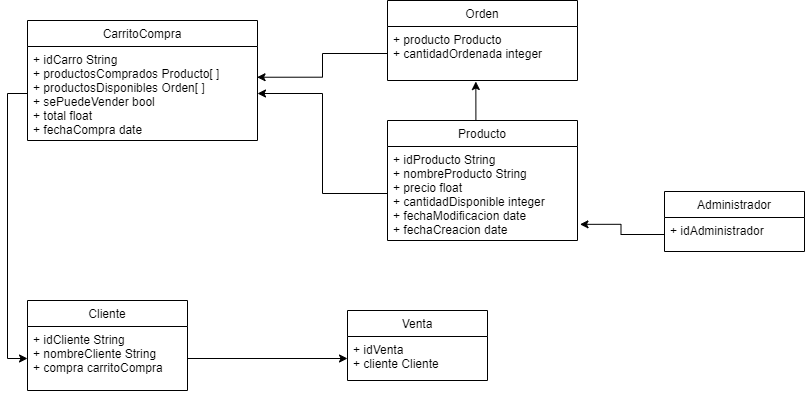
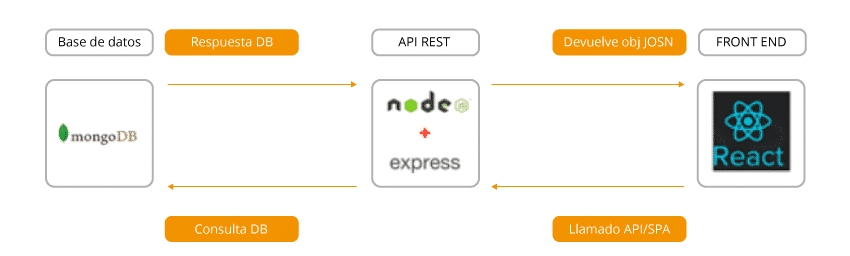

# Supermercados Fruver

## Contenido
* [General info](#general-info)
* [Tecnologias](#Tecnologias)
* [Integrantes](#Integrantes)

## General info
Supermercados Fruver es una tienda de barrio que, para escalar sus operaciones y poder penetras al mercado más amplio de los barrios colindantes, requiere del desarrollo de una página web. Ésta debe permitirle a un administrador cargar o modificar su portafolio de productos, con precios y gramajes, para que pueda visualizarlos y gestionar la cantidad de productos vendidos. De igual forma, debe dejar que un cliente visualice el portafolio de productos, selecciones aquel que sea de su interés y vaya cargando sus selecciones en un carrito de compras. Es importante notar que cuando el cliente seleccione un producto para el carrito de compras, esto afectará el stock de productos que observa el administrador.

## Tecnologias
El proyecto se crea con el conjunto de subsistemas MERN:
*   Mongo DB
*   Express.JS
*   React
*   NodeJS

## Integrantes
Integrantes:

Nombre: David Baena
Correo: david16baena@gmail.com
Rol: Scrum Master

Nombre: Geraldine Alvarez
Correo: geraldinealvarez041@gmail.com
Rol: Administradora de configuración

Nombre: Wilmar Arley Zapata
Correo: carewaz23@hotmail.com
Rol: Tester

Nombre: Juan Pablo Cardona Torres
Correo: juan-c16@hotmail.com
Rol: Diseñador de software

Nombre: Andrea Perez
Correo: aisabelperezd14@gmail.com
Rol: Diseñadora UI
